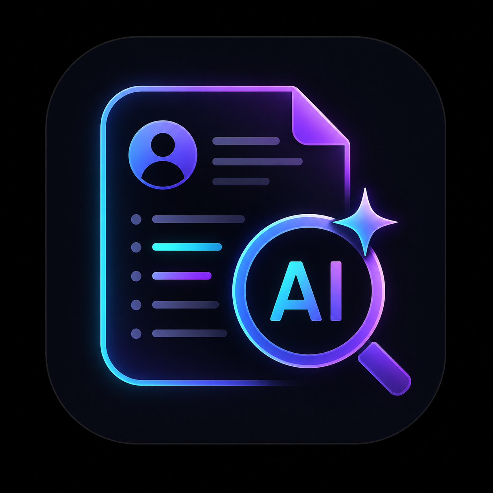

<p align="center">
  
</p>

<h1 align="center">🔍 HireLens — AI Resume Critique</h1>

<p align="center">
  <em>Get brutally honest, expert-level feedback on your resume — powered by AI.</em>
</p>

<p align="center">
  
  
  
</p>

---

## 💡 What is HireLens?

**HireLens** is an AI-powered resume analysis tool that acts as your personal career advisor. Upload your resume, optionally specify a target job role, and receive a comprehensive, structured critique covering everything from ATS compatibility to recruiter-readiness.

No fluff. No generic advice. Just actionable insights to make your resume stand out.

---

## ✨ Features

| Feature | Description |
|---|---|
| 📄 **PDF & TXT Support** | Upload resumes in PDF or plain text format |
| 🎯 **Job Role Targeting** | Optionally tailor feedback to a specific role |
| 📊 **Scored Breakdown** | Get scores across 6 categories (Content, Experience, ATS, Skills, Structure, Grammar) |
| 🤖 **ATS Analysis** | Keyword matching, compatibility checks, and optimization tips |
| ✍️ **Bullet Rewrites** | Weak bullet points are identified and rewritten with impact |
| 👀 **Recruiter Perspective** | See your resume through a recruiter's eyes |
| 📋 **Action Plan** | A prioritized checklist of the most impactful changes |

---

## 🚀 Getting Started

### Prerequisites

- **Python 3.13+**
- **[uv](https://docs.astral.sh/uv/)** (recommended package manager)
- **NVIDIA API Key** — Get one from [NVIDIA AI](https://build.nvidia.com/)

### Installation

1. **Clone the repository**
   ```bash
   git clone https://github.com/HariCodez07/Resume-Critique.git
   cd Resume-Critique
   ```

2. **Install dependencies**
   ```bash
   uv sync
   ```

3. **Set up environment variables**

   Create a `.env` file in the root directory:
   ```env
   NVIDIA_API_KEY=your_nvidia_api_key_here
   ```

4. **Run the app**
   ```bash
   uv run streamlit run main.py
   ```

   The app will open in your browser at `http://localhost:8501` 🎉

---

## 🛠️ Tech Stack

- **[Streamlit](https://streamlit.io/)** — Interactive web UI
- **[OpenAI SDK](https://github.com/openai/openai-python)** — LLM communication (NVIDIA-compatible)
- **[PyPDF2](https://pypdf2.readthedocs.io/)** — PDF text extraction
- **[python-dotenv](https://github.com/theskumar/python-dotenv)** — Secure environment variable management

---

## 📸 How It Works

```
📄 Upload Resume (PDF/TXT)
        ↓
🎯 (Optional) Enter Target Job Role
        ↓
🤖 AI Analyzes Your Resume
        ↓
📊 Receive Detailed Critique
   ├── Overall Score (/100)
   ├── Category Breakdown
   ├── Top 5 Improvements
   ├── Section-by-Section Review
   ├── Bullet Point Rewrites
   ├── ATS Readiness Score
   ├── Recruiter Perspective
   └── Final Action Plan
```

---

## 📁 Project Structure

```
Resume-Critique/
├── main.py            # Streamlit app & core logic
├── pyproject.toml     # Project config & dependencies
├── README.md
├── .env               # API keys (not tracked)
├── imgs/
│   └── AIRES.png      # App branding asset
└── src/
    └── resume_critique/
```

---

## ⚠️ Environment Variables

| Variable | Required | Default | Description |
|---|---|---|---|
| `NVIDIA_API_KEY` | ✅ | — | Your NVIDIA API key |
| `NVIDIA_BASE_URL` | ❌ | `https://integrate.api.nvidia.com/v1` | API endpoint |
| `NVIDIA_MODEL` | ❌ | `openai/gpt-oss-20b` | Model to use |

---

## 🤝 Contributing

Contributions are welcome! Feel free to open an issue or submit a pull request.

---

## 📜 License

This project is open source and available under the [MIT License](LICENSE).

---

<p align="center">
  Built with ❤️ by <a href="https://github.com/HariCodez07">HariCodez07</a>
</p>